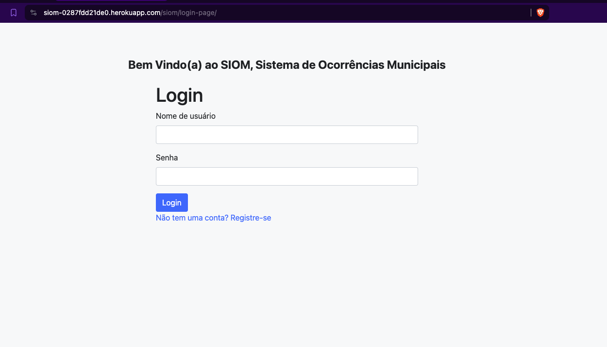
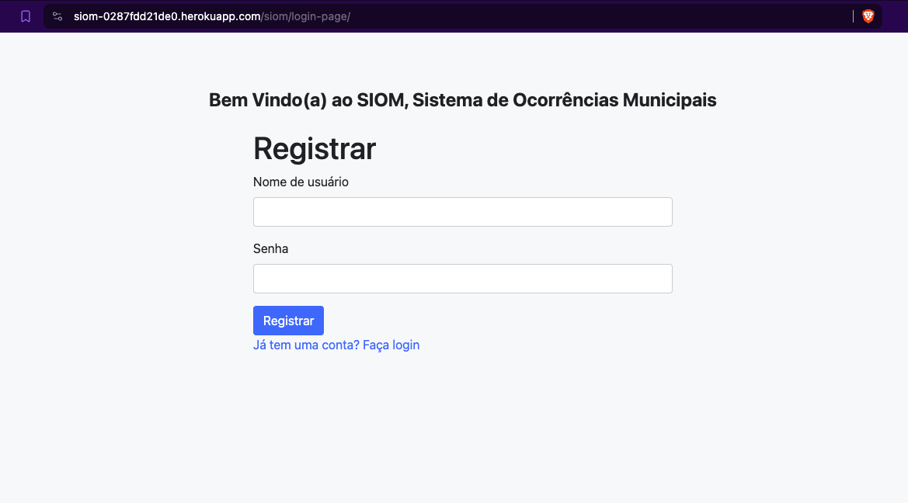
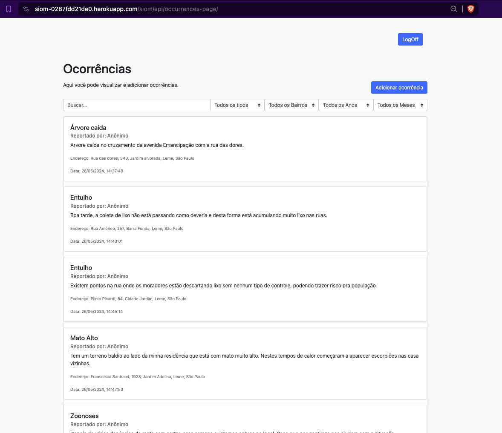
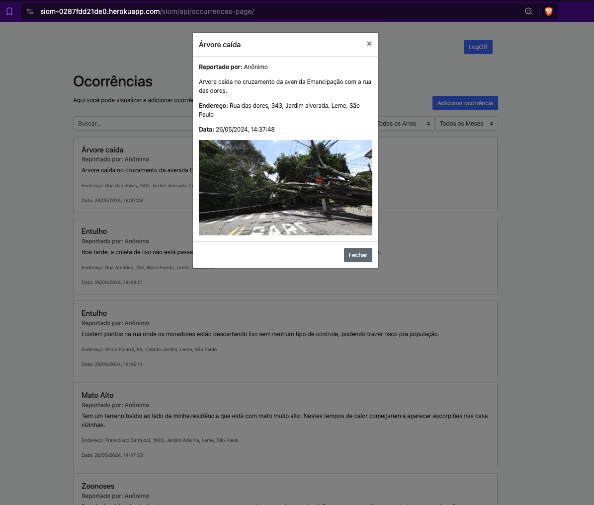
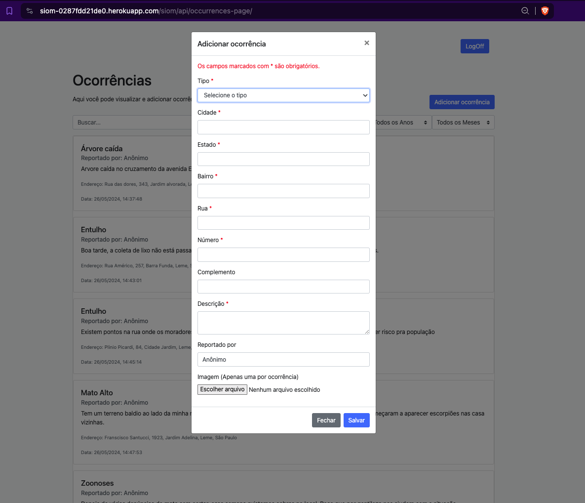
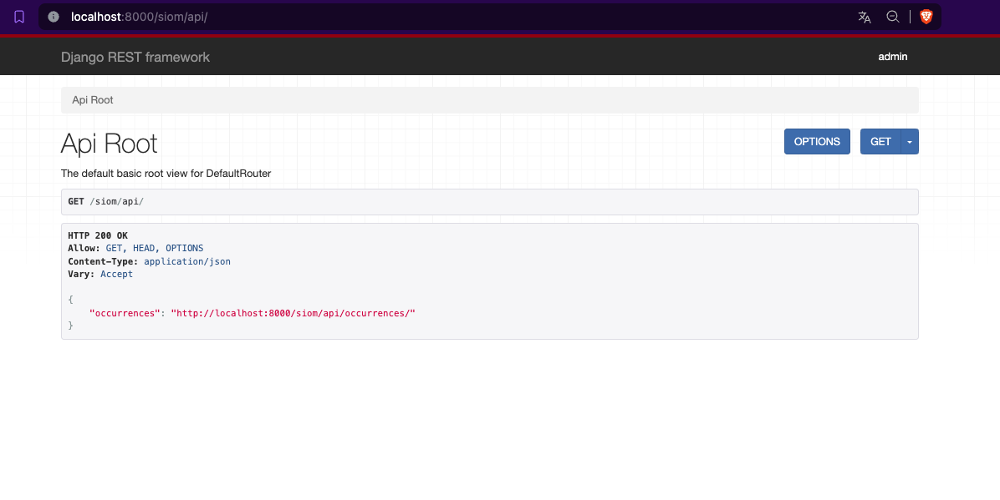
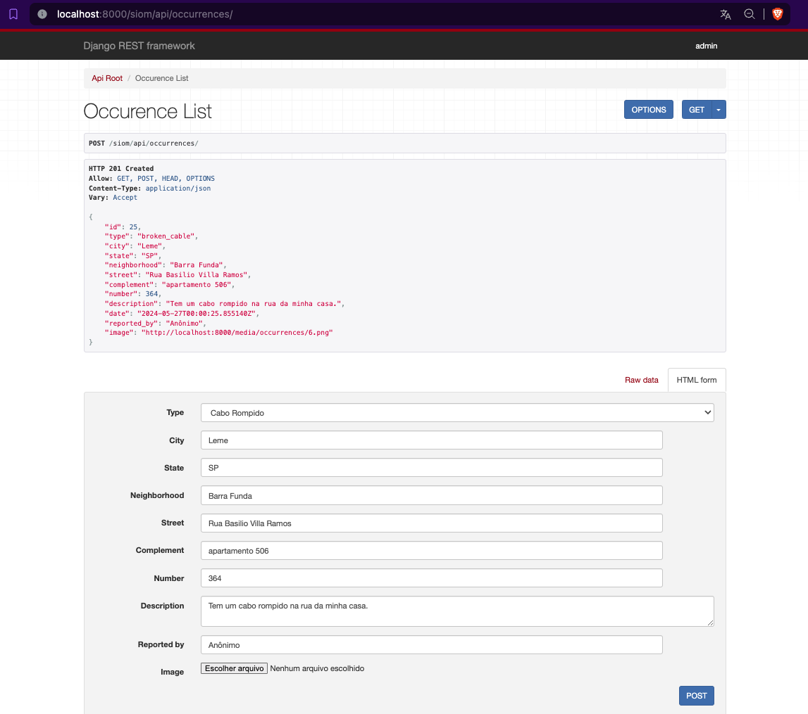
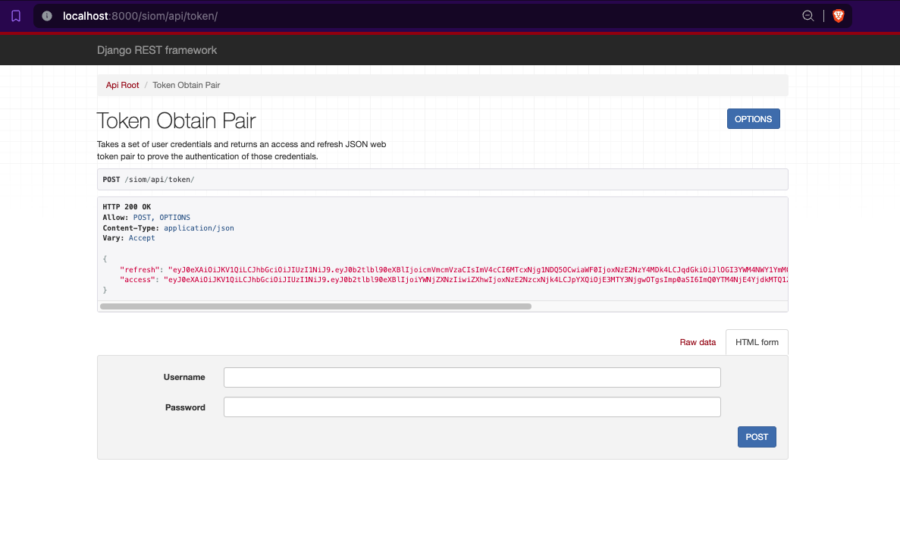
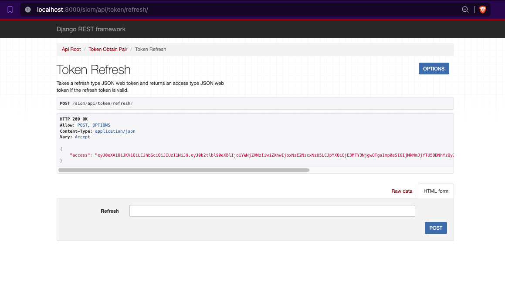
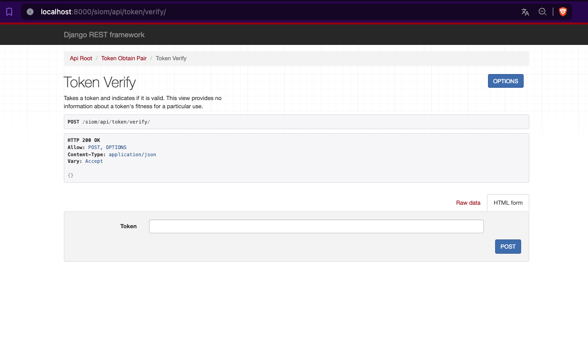

# SIOM (Municipal Occurrence Information System)

## Description

This project is an occurrence management system developed with Django and Django Rest Framework. It allows users to record and manage different types of occurrences, including but not limited to, broken cables, fallen trees, rubble, public lighting issues, asphalt, flooding, high grass, zoonoses, robberies, sewer, loud noise, and illegal fires.

The aim of this system is to facilitate the reporting and management of occurrences in a city, allowing the relevant authorities to be notified and take efficient action. Each occurrence can be associated with a specific location (city, state, neighborhood, street, and number) and an image, allowing for precise mapping of occurrences.

## Installation

1. Clone this repository.
2. Enter the project directory with `cd siom`.
3. Run `make build` to build the Docker image.
4. Run `make run` to start the Docker container.
5. Run the migrations with `make migrations` and `make migrate`.

## Usage

1. Access the admin interface at `http://localhost:8000/admin` to manage occurrences.
2. Access the API at `http://localhost:8000/api` to interact with the system programmatically.

## Contributing

Pull requests are welcome. For major changes, please open an issue first to discuss what you would like to change.

## License

[MIT](https://choosealicense.com/licenses/mit/)

## FrontEnd Pictures

### Login Page

### Register Page

### Home Page

### Detail Page

### Occurrence Page

## API Pictures

### Home Page

### Occurrence

### Token

### Refresh Token

### Verify Token

